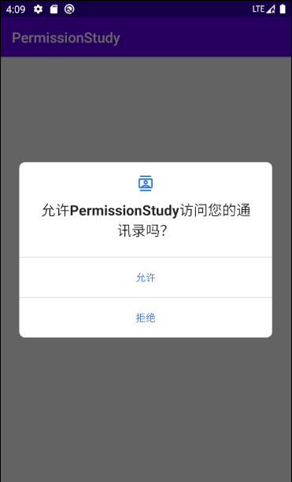
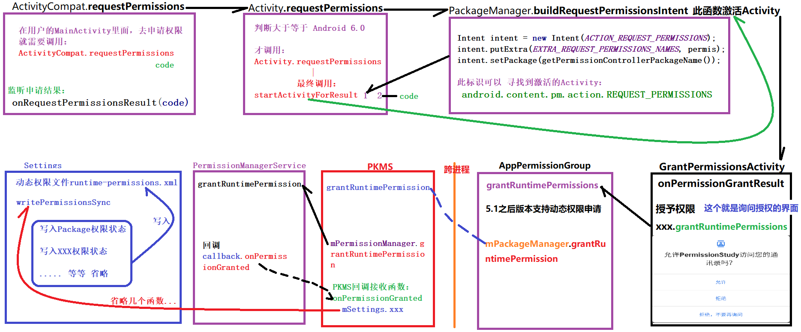
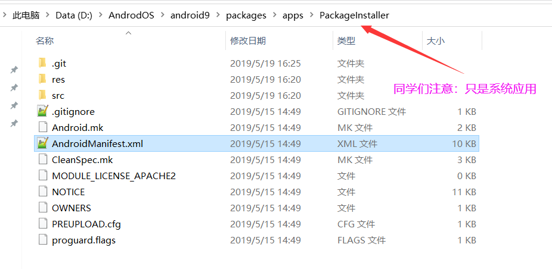
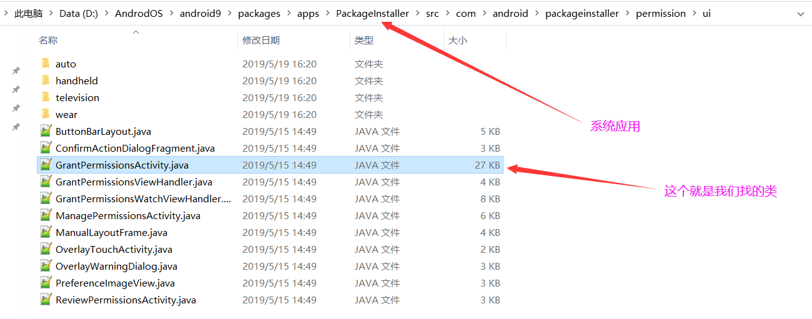
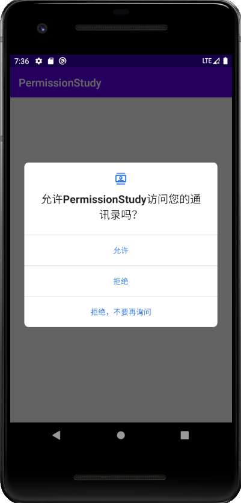
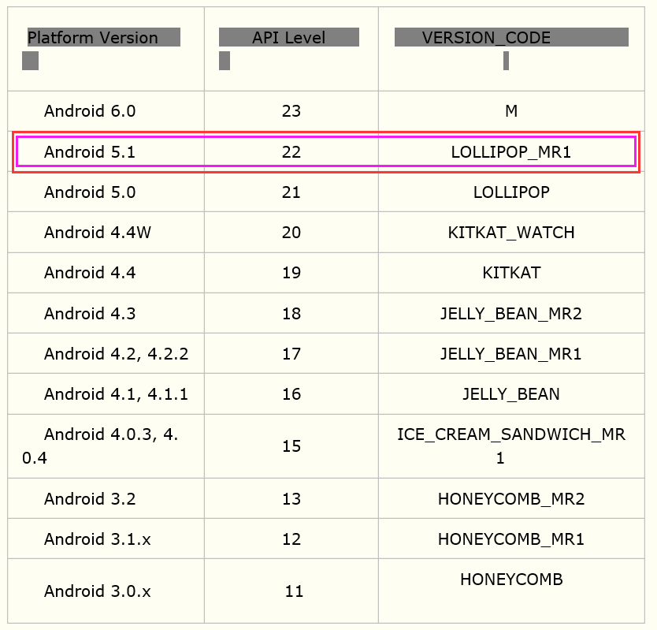
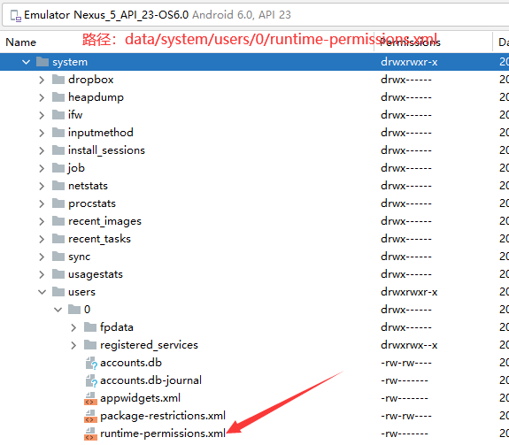
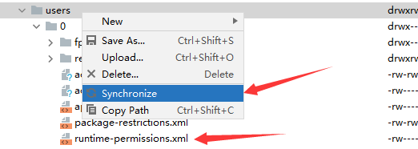
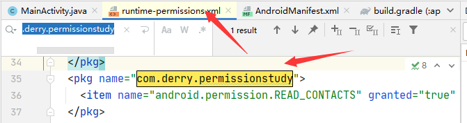
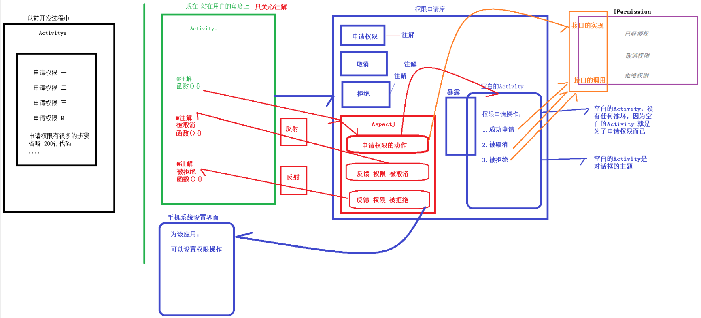

#### 课程大纲：
```
PKMS权限申请实战

1.动态权限申请概念讲解
2.requestPermissions源码流程阅读
3.手写无侵入式权限框架

预习资料：同学们有时间的话，可以看看Derry老师写的，PKMS第二节课预习资料
```

##### SourceInsight 不断无响应的问题
https://www.iteye.com/blog/maricoliu-1474634

---

#### 1.动态权限申请概念讲解
##### 动态申请权限的权限组：
Google在 Android 6.0 开始引入了权限申请机制，将所有权限分成了正常权限和危险权限。
同学们注意：App每次在使用危险权限时需要动态的申请并得到用户的授权才能使用。
权限的分类：
系统权限分为两类：正常权限 和 危险权限。
正常权限不会直接给用户隐私权带来风险。如果您的应用在其清单中列出了正常权限，系统将自动授予该权限。
危险权限会授予应用访问用户机密数据的权限。如果您的应用在其清单中列出了正常权限，系统将自动授予该权限。如果您列出了危险权限，则用户必须明确批准您的应用使用这些权限。
那么，那些是危险权限呢，为什么是危险权限呢？ 要和同学们说清楚
```
    <!-- 权限组：CALENDAR == 日历读取的权限申请 -->
    <uses-permission android:name="android.permission.READ_CALENDAR" />
    <uses-permission android:name="android.permission.WRITE_CALENDAR" />

    <!-- 权限组：CAMERA == 相机打开的权限申请 -->
    <uses-permission android:name="android.permission.CAMERA" />

    <!-- 权限组：CONTACTS == 联系人通讯录信息获取/写入的权限申请 -->
    <uses-permission android:name="android.permission.READ_CONTACTS" />
    <uses-permission android:name="android.permission.WRITE_CONTACTS" />

    <!-- 权限组：LOCATION == 位置相关的权限申请 -->
    <uses-permission android:name="android.permission.ACCESS_FINE_LOCATION" />
    <uses-permission android:name="android.permission.ACCESS_COARSE_LOCATION" />

    <!-- 权限组：PHONE == 拨号相关的权限申请 -->
    <uses-permission android:name="android.permission.CALL_PHONE" />
    <uses-permission android:name="android.permission.READ_PHONE_STATE" />

    <!-- 权限组：SMS == 短信相关的权限申请 -->
    <uses-permission android:name="android.permission.SEND_SMS" />
    <uses-permission android:name="android.permission.READ_SMS" />

    <!-- 权限组：STORAGE == 读取存储相关的权限申请 -->
    <uses-permission android:name="android.permission.READ_EXTERNAL_STORAGE" />
    <uses-permission android:name="android.permission.WRITE_EXTERNAL_STORAGE" />
```

##### 核心函数介绍
```
ContextCompat.checkSelfPermission
检查应用是否具有某个危险权限。如果应用具有此权限，方法将返回 PackageManager.PERMISSION_GRANTED，并且应用可以继续操作。
如果应用不具有此权限，方法将返回 PackageManager.PERMISSION_DENIED，且应用必须明确向用户要求权限。
```

```
ActivityCompat.requestPermissions
应用可以通过这个方法动态申请权限，调用后会弹出一个对话框提示用户授权所申请的权限。
```

```
ActivityCompat.shouldShowRequestPermissionRationale
如果应用之前请求过此权限但用户拒绝了请求，此方法将返回 true。如果用户在过去拒绝了权限请求，
并在权限请求系统对话框中选择了 Don't ask again 选项，此方法将返回 false。如果设备规范禁止应用具有该权限，此方法也会返回 false。
```

```
onRequestPermissionsResult
当应用请求权限时，系统将向用户显示一个对话框。当用户响应时，系统将调用应用的 onRequestPermissionsResult() 方法，向其传递用户响应，处理对应的场景。
```

##### 动态权限实例演示
同学们注意，现在演示，上面 “核心函数”实例：
```
<!-- 第一步：在AndroidManifest.xml中添加所需权限。 -->
<uses-permission android:name="android.permission.READ_CONTACTS" />
```

```
    @Override
    protected void onCreate(Bundle savedInstanceState) {
        super.onCreate(savedInstanceState);
        setContentView(R.layout.activity_main);

        requestPermission();
    }

    // 第二步：封装了一个requestPermission方法来动态检查和申请权限
    private void requestPermission() {

        Log.i(TAG,"requestPermission");

        // Here, thisActivity is the current activity
        if (ContextCompat.checkSelfPermission(this, Manifest.permission.READ_CONTACTS) != PackageManager.PERMISSION_GRANTED) {
            Log.i(TAG,"checkSelfPermission");

            // Should we show an explanation?
            if (ActivityCompat.shouldShowRequestPermissionRationale(this, Manifest.permission.READ_CONTACTS)) {
                Log.i(TAG,"shouldShowRequestPermissionRationale");

                // Show an expanation to the user *asynchronously* -- don't block
                // this thread waiting for the user's response! After the user
                // sees the explanation, try again to request the permission.

                ActivityCompat.requestPermissions(this,
                        new String[]{Manifest.permission.READ_CONTACTS},
                        MY_PERMISSIONS_REQUEST_READ_CONTACTS);

            } else {
                Log.i(TAG,"requestPermissions");
                // No explanation needed, we can request the permission.
                ActivityCompat.requestPermissions(this,
                        new String[]{Manifest.permission.READ_CONTACTS},
                        MY_PERMISSIONS_REQUEST_READ_CONTACTS);
                // MY_PERMISSIONS_REQUEST_READ_CONTACTS is an
                // app-defined int constant. The callback method gets the
                // result of the request.
            }
        }
    }
```

```
    // 第三步：重写onRequestPermissionsResult方法根据用户的不同选择做出响应。
    @Override
    public void onRequestPermissionsResult(int requestCode,
                                           String permissions[], int[] grantResults) {
        switch (requestCode) {
            case MY_PERMISSIONS_REQUEST_READ_CONTACTS: {
                // If request is cancelled, the result arrays are empty.
                if (grantResults.length > 0
                        && grantResults[0] == PackageManager.PERMISSION_GRANTED) {
                    Log.i(TAG,"onRequestPermissionsResult granted");
                    // permission was granted, yay! Do the
                    // contacts-related task you need to do.

                } else {
                    Log.i(TAG,"onRequestPermissionsResult denied");
                    // permission denied, boo! Disable the
                    // functionality that depends on this permission.
                    showWaringDialog();
                }
                return;
            }

            // other 'case' lines to check for other
            // permissions this app might request
        }
    }

    // 如果点击 拒绝，就会弹出这个
    private void showWaringDialog() {
        new AlertDialog.Builder(this)
                .setTitle("警告！")
                .setMessage("请前往设置->应用->PermissionDemo->权限中打开相关权限，否则功能无法正常运行！")
                .setPositiveButton("确定", new DialogInterface.OnClickListener() {
                    @Override
                    public void onClick(DialogInterface dialog, int which) {
                        // 一般情况下如果用户不授权的话，功能是无法运行的，做退出处理
                        finish();
                    }
                }).show();
    }
```

运行结果：



#### 2.requestPermissions源码流程阅读-15步
##### 1.流程图介绍
总结上面的几个 ”核心函数“
```
检查权限
checkSelfPermission(@NonNull String permission) 

申请权限
requestPermissions(@NonNull String[] permissions, int requestCode)  

处理结果回调
onRequestPermissionsResult(int requestCode, @NonNull String[] permissions, @NonNull int[] grantResults) 

是否需要显示UI界面提示用户为什么需要这个权限
shouldShowRequestPermissionRationale(@NonNull String permission)    
```

权限申请源码流程总结:
第一步：MainActivity 调用 requestPermissions 进行动态权限申请；
第二步：requestPermissions函数通过隐士意图，激活PackageInstaller的GrantPermissionsActivity界面，让用户选择是否授权；
第三步：经过PKMS把相关信息传递给PermissionManagerService处理；
第四步：PermissionManagerService处理结束后回调给---->PKMS中的onPermissionGranted方法把处理结果返回；
第五步：PKMS通知过程中权限变化，并调用writeRuntimePermissionsForUserLPr函数让PackageManager的settings记录下相关授权信息；
权限申请整体流程图：

##### 2.MainActiivty:
```
ActivityCompat.requestPermissions(this, new String[]{Manifest.permission.READ_CONTACTS},
                                    MY_PERMISSIONS_REQUEST_READ_CONTACTS);
```

##### 3.ActivityCompat.requestPermissions:
```
public static void requestPermissions(final @NonNull Activity activity,
            final @NonNull String[] permissions, final @IntRange(from = 0) int requestCode) {
        if (sDelegate != null
                && sDelegate.requestPermissions(activity, permissions, requestCode)) {
            // Delegate has handled the permission request.
            return;
        }

        if (Build.VERSION.SDK_INT >= 23) {
            if (activity instanceof RequestPermissionsRequestCodeValidator) {
                ((RequestPermissionsRequestCodeValidator) activity)
                        .validateRequestPermissionsRequestCode(requestCode);
            }
            // 【同学们注意】，重点是看这句代码，就是权限申请， 下面代码就会分析这句代码
            activity.requestPermissions(permissions, requestCode);
        } else if (activity instanceof OnRequestPermissionsResultCallback) {
           ....
        }
    }
```

##### 4.Activity.requestPermissions:
位置：frameworks/base/core/java/android/app/Activity.java
```
public final void requestPermissions(@NonNull String[] permissions, int requestCode) {
    if (requestCode < 0) {
        throw new IllegalArgumentException("requestCode should be >= 0");
    }
    if (mHasCurrentPermissionsRequest) {
        Log.w(TAG, "Can request only one set of permissions at a time");
        // Dispatch the callback with empty arrays which means a cancellation.
        onRequestPermissionsResult(requestCode, new String[0], new int[0]);
        return;
    }
    // 【同学们注意】 关注 buildRequestPermissionsIntent，下面会分析这个函数
    Intent intent = getPackageManager().buildRequestPermissionsIntent(permissions);
    startActivityForResult(REQUEST_PERMISSIONS_WHO_PREFIX, intent, requestCode, null);
    mHasCurrentPermissionsRequest = true;
}
```

##### 5.PackageManager.buildRequestPermissionsIntent：
位置：frameworks/base/core/java/android/content/pm/PackageManager.java
```
    public Intent buildRequestPermissionsIntent(@NonNull String[] permissions) {
        if (ArrayUtils.isEmpty(permissions)) {
           throw new IllegalArgumentException("permission cannot be null or empty");
        }
        Intent intent = new Intent(ACTION_REQUEST_PERMISSIONS);
        intent.putExtra(EXTRA_REQUEST_PERMISSIONS_NAMES, permissions);
        intent.setPackage(getPermissionControllerPackageName());
        return intent;
    }
```
总结：这个buildRequestPermissionsIntent函数的目的，就是去 激活某个Activity，就这么简单，哈哈哈。
啊...... 一脸懵逼，Derry你说了什么东西啊？，Derry你在这么调皮把你吊起来打

慢慢来分析：
同学们注意：灵感来自与此(既然buildRequestPermissionsIntent函数是为了拼接一个Intent，那么想都不用想，一定是想搞隐士意图来激活某个Activity，这个灵感非常关键，同学们以后遇到Intent的封装，就应该想到是为了什么了吧，是不是为了激活某个Activity)
public static final String ACTION_REQUEST_PERMISSIONS = "android.content.pm.action.REQUEST_PERMISSIONS";
那么我们就根据  ”android.content.pm.action.REQUEST_PERMISSIONS“ 表示动作来找到 需要激活的某个Activity不就行了，同学们是不是很简单

##### 6.apps/PackageInstaller/AndroidManfiest.xml
```
        同学们注意：下面我们就分析 GrantPermissionsActivity
        <activity android:name=".permission.ui.GrantPermissionsActivity"
                android:configChanges="orientation|keyboardHidden|screenSize"
                android:excludeFromRecents="true"
                android:theme="@style/GrantPermissions"
                android:visibleToInstantApps="true">
            
                <!-- 那么我们就根据  ”android.content.pm.action.REQUEST_PERMISSIONS“ 表示动作来找到 
                     需要激活的某个Activity不就行了，同学们是不是很简单 -->
                <intent-filter android:priority="1">
                    <action android:name="android.content.pm.action.REQUEST_PERMISSIONS" />
                    <category android:name="android.intent.category.DEFAULT" />
                </intent-filter>
        </activity>
```

打开GrantPermissionsActivity

##### 7.GrantPermissionsActivity.onPermissionGrantResult函数：
同学们注意，原来GrantPermissionsActivity也就是我们常见的权限申请界面，用户可以根据提示选择是否授权给应用相应的权限。用户操作后的结果会通过回调GrantPermissionsActivity的onPermissionGrantResult方法返回。在onPermissionGrantResult方法中会根据返回结果去决定是走授予权限还是撤销权限流程，然后会更新授权结果，最后返回结果并结束自己：

```
    @Override
    public void onPermissionGrantResult(String name, boolean granted, boolean doNotAskAgain) {
        GroupState groupState = mRequestGrantPermissionGroups.get(name);
        if (groupState.mGroup != null) {
            if (granted) {
                // 【同学们注意】重点是这个 授予权限， 下面会分析这个函数grantRuntimePermissions
                // 授予权限
                groupState.mGroup.grantRuntimePermissions(doNotAskAgain,
                        groupState.affectedPermissions);
                groupState.mState = GroupState.STATE_ALLOWED;
            } else {
                // 撤销权限
                groupState.mGroup.revokeRuntimePermissions(doNotAskAgain,
                        groupState.affectedPermissions);
                groupState.mState = GroupState.STATE_DENIED;

                int numRequestedPermissions = mRequestedPermissions.length;
                for (int i = 0; i < numRequestedPermissions; i++) {
                    String permission = mRequestedPermissions[i];

                    if (groupState.mGroup.hasPermission(permission)) {
                        EventLogger.logPermissionDenied(this, permission,
                                mAppPermissions.getPackageInfo().packageName);
                    }
                }
            }
            // 更新授权结果
            updateGrantResults(groupState.mGroup);
        }
        if (!showNextPermissionGroupGrantRequest()) {
            // 返回授权结果并结束自己
            setResultAndFinish();
        }
    }
```

##### 8.AppPermissionGroup.grantRuntimePermissions
接下来继续跟踪AppPermissionGroup.grantRuntimePermissions方法分析授权流程。
AppPermissionGroup.grantRuntimePermissions方法中会判断targetSdkVersion是否大于LOLLIPOP_MR1（22），如果大于则做动态权限申请处理
位置： packages/apps/PackageInstaller/src/com/android/packageinstaller/permission/model/AppPermissionGroup.java

```
    public boolean grantRuntimePermissions(boolean fixedByTheUser, String[] filterPermissions) {
        final int uid = mPackageInfo.applicationInfo.uid;

        // We toggle permissions only to apps that support runtime
        // permissions, otherwise we toggle the app op corresponding
        // to the permission if the permission is granted to the app.
        for (Permission permission : mPermissions.values()) {
            ...
            if (mAppSupportsRuntimePermissions) {
                // 【同学们注意】 在Android 5.1后，就需要支持动态申请权限啦
                // LOLLIPOP_MR1之后版本，支持动态权限申请
                // Do not touch permissions fixed by the system.
                if (permission.isSystemFixed()) {
                    return false;
                }

                // Ensure the permission app op enabled before the permission grant.
                if (permission.hasAppOp() && !permission.isAppOpAllowed()) {
                    permission.setAppOpAllowed(true);
                    mAppOps.setUidMode(permission.getAppOp(), uid, AppOpsManager.MODE_ALLOWED);
                }

                // Grant the permission if needed.
                if (!permission.isGranted()) {
                    permission.setGranted(true);
                    
                    // 【同学们注意】 这里很关键, 通过 mPackageManager.grantRuntimePermission 跨进程到 PKMS
                    // 下面我们就分析这个操作了哦，注意哦
                    // 熟悉Android源码的同学都知道XXXManager只是一个辅助类，其真正提供服务的都是XXXManagerService，
                    // 所以直接跳转PackageManagerService中的grantRuntimePermission方法。
                    mPackageManager.grantRuntimePermission(mPackageInfo.packageName,
                            permission.getName(), mUserHandle);
                }

                // Update the permission flags.
                if (!fixedByTheUser) {
                    // Now the apps can ask for the permission as the user
                    // no longer has it fixed in a denied state.
                    if (permission.isUserFixed() || permission.isUserSet()) {
                        permission.setUserFixed(false);
                        permission.setUserSet(false);
                        mPackageManager.updatePermissionFlags(permission.getName(),
                                mPackageInfo.packageName,
                                PackageManager.FLAG_PERMISSION_USER_FIXED
                                        | PackageManager.FLAG_PERMISSION_USER_SET,
                                0, mUserHandle);
                    }
                }
            } else {
                // LOLLIPOP_MR1之前版本，不支持动态权限申请
                // Legacy apps cannot have a not granted permission but just in case.
                ....
            }
        }

        return true;
    }
```
终于到了 PKMS了，是不是很开心了：

##### 9.PKMS.grantRuntimePermission
位置：frameworks/base/services/core/java/com/android/server/pm/PackageManagerService.java
```
    @Override
    public void grantRuntimePermission(String packageName, String permName, final int userId) {
        mPermissionManager.grantRuntimePermission(permName, packageName, false /*overridePolicy*/,
                getCallingUid(), userId, mPermissionCallback);
    }
```

##### 10.PermissionManagerService.grantRuntimePermission
PermissionManagerInternal---- 接口到实现 ---PermissionManagerService.grantRuntimePermission:
D:\ANDROID\android9\frameworks\base\services\core\java\com\android\server\pm\permission\PermissionManagerService.java
```
    private void grantRuntimePermission(String permName, String packageName, boolean overridePolicy,
            int callingUid, final int userId, PermissionCallback callback) {
        // 检查用户是否存在
        if (!mUserManagerInt.exists(userId)) {
            Log.e(TAG, "No such user:" + userId);
            return;
        }
        // 检查PackageInstaller是否有动态权限授权权限
        mContext.enforceCallingOrSelfPermission(
                android.Manifest.permission.GRANT_RUNTIME_PERMISSIONS,
                "grantRuntimePermission");
        ...
        
        // 【同学们注意】 下面会分析这个回调
        // 回调PermissionCallback的onPermissionGranted方法通知授予权限
        if (callback != null) {
            callback.onPermissionGranted(uid, userId);
        }
        ...
    }
```

##### 11.PKMS.onPermissionGranted(回调回PKMS)
又回到 PKMS，位置： frameworks/base/services/core/java/com/android/server/pm/PackageManagerService.java
```
        // 回调的是PackageManagerService中的PermissionCallback，在其实现的onPermissionGranted方法中会去通知观察者权            
        // 限发生变化，并调用PackageManager的Settings记录动态权限授权状态。
        @Override
        public void onPermissionGranted(int uid, int userId) {
            mOnPermissionChangeListeners.onPermissionsChanged(uid);

            // Not critical; if this is lost, the application has to request again.
            synchronized (mPackages) {
                // [同学们注意] 下面会分钟分析这个函数
                mSettings.writeRuntimePermissionsForUserLPr(userId, false);
            }
        }
```

##### 12.Settings.writePermissionsSync
调用流程: mSettings.writeRuntimePermissionsForUserLPr --->  writePermissionsForUserSyncLPr ----> writePermissionsSync:
位置: frameworks/base/services/core/java/com/android/server/pm/Settings.java
> 同学们注意：最终会通过这个类将相应的权限写入data/system/users/0/runtime-permissions.xml这个文件中，供其他接口调用

```
        // 同学们注意: 
        // writePermissionsSync方法来完成最后的记录工作。
        // writePermissionsSync方法的代码很长，但是逻辑很清晰，就是先查询与应用相关的所有权限状态，
        // 然后创建 runtime-permissions.xml 文件把这些信息记录进去。
        private void writePermissionsSync(int userId) {
            //  动态权限文件（runtime-permissions.xml）
            AtomicFile destination = new AtomicFile(getUserRuntimePermissionsFile(userId),
                    "package-perms-" + userId);

            ArrayMap<String, List<PermissionState>> permissionsForPackage = new ArrayMap<>();
            ArrayMap<String, List<PermissionState>> permissionsForSharedUser = new ArrayMap<>();

            synchronized (mPersistenceLock) {
                mWriteScheduled.delete(userId);
                // 获得Package权限状态
                final int packageCount = mPackages.size();
                for (int i = 0; i < packageCount; i++) {
                    String packageName = mPackages.keyAt(i);
                    PackageSetting packageSetting = mPackages.valueAt(i);
                    if (packageSetting.sharedUser == null) {
                        PermissionsState permissionsState = packageSetting.getPermissionsState();
                        List<PermissionState> permissionsStates = permissionsState
                                .getRuntimePermissionStates(userId);
                        if (!permissionsStates.isEmpty()) {
                            permissionsForPackage.put(packageName, permissionsStates);
                        }
                    }
                }
                // 获得SharedUser权限状态
                final int sharedUserCount = mSharedUsers.size();
                for (int i = 0; i < sharedUserCount; i++) {
                    String sharedUserName = mSharedUsers.keyAt(i);
                    SharedUserSetting sharedUser = mSharedUsers.valueAt(i);
                    PermissionsState permissionsState = sharedUser.getPermissionsState();
                    List<PermissionState> permissionsStates = permissionsState
                            .getRuntimePermissionStates(userId);
                    if (!permissionsStates.isEmpty()) {
                        permissionsForSharedUser.put(sharedUserName, permissionsStates);
                    }
                }
            }

            FileOutputStream out = null;
            try {
                out = destination.startWrite();
                // 创建xml文件用于记录权限状态
                XmlSerializer serializer = Xml.newSerializer();
                serializer.setOutput(out, StandardCharsets.UTF_8.name());
                serializer.setFeature(
                        "http://xmlpull.org/v1/doc/features.html#indent-output", true);
                serializer.startDocument(null, true);

                serializer.startTag(null, TAG_RUNTIME_PERMISSIONS);

                String fingerprint = mFingerprints.get(userId);
                if (fingerprint != null) {
                    serializer.attribute(null, ATTR_FINGERPRINT, fingerprint);
                }
                // 写入Package权限状态
                final int packageCount = permissionsForPackage.size();
                for (int i = 0; i < packageCount; i++) {
                    String packageName = permissionsForPackage.keyAt(i);
                    List<PermissionState> permissionStates = permissionsForPackage.valueAt(i);
                    serializer.startTag(null, TAG_PACKAGE);
                    serializer.attribute(null, ATTR_NAME, packageName);
                    writePermissions(serializer, permissionStates);
                    serializer.endTag(null, TAG_PACKAGE);
                }
                 // 写入SharedUser权限状态
                final int sharedUserCount = permissionsForSharedUser.size();
                for (int i = 0; i < sharedUserCount; i++) {
                    String packageName = permissionsForSharedUser.keyAt(i);
                    List<PermissionState> permissionStates = permissionsForSharedUser.valueAt(i);
                    serializer.startTag(null, TAG_SHARED_USER);
                    serializer.attribute(null, ATTR_NAME, packageName);
                    writePermissions(serializer, permissionStates);
                    serializer.endTag(null, TAG_SHARED_USER);
                }

                serializer.endTag(null, TAG_RUNTIME_PERMISSIONS);
                // 写入结束
                serializer.endDocument();
                destination.finishWrite(out);

                if (Build.FINGERPRINT.equals(fingerprint)) {
                    mDefaultPermissionsGranted.put(userId, true);
                }
            // Any error while writing is fatal.
            } catch (Throwable t) {
                Slog.wtf(PackageManagerService.TAG,
                        "Failed to write settings, restoring backup", t);
                destination.failWrite(out);
            } finally {
                IoUtils.closeQuietly(out);
            }
        }
```

##### 13.安装后查阅权限文件
如果安装了应用，并且授权了，
然后同步

是可以在 runtime-permissions.xml 中查询到 com.derry.permissionstudy


##### 14.卸载后查阅权限文件
如果卸载了应用
然后同步

就查询不到 com.derry.permissionstudy 了，因为卸载时，会删除com.derry.permissionstudy的信息

##### 15.权限申请源码流程总结:
第一步：MainActivity 调用 requestPermissions 进行动态权限申请；
第二步：requestPermissions函数通过隐士意图，激活PackageInstaller的GrantPermissionsActivity界面，让用户选择是否授权；
第三步：经过PKMS把相关信息传递给PermissionManagerService处理；
第四步：PermissionManagerService处理结束后回调给---->PKMS中的onPermissionGranted方法把处理结果返回；
第五步：PKMS通知过程中权限变化，并调用writeRuntimePermissionsForUserLPr函数让PackageManager的settings记录下相关授权信息；

#### 3.手写无侵入式权限框架
##### 上课时的画图(完整版).png


##### 笔记草稿
```
以后的框架，应该都需要是 ，无侵入式的（由框架劫持用户的行为） AspectJ 劫持函数的执行

AspectJ 为什么可以无侵入式的 监听+劫持 我们的任何注解
javac                       Test.java   Test.class    (JVM只认识class) （我们看不懂字节码，JVM看得懂）
AspectJ(Javac)      Test.java 注入代码  Test.class    (JVM只认识class) （我们看不懂字节码，JVM看得懂）

空白的Activity（申请权限  申请成功 申请失败 用户拒绝申请 回调给外界 告诉AspectJ）

任何一个框架，都有三种方式实现：
1.无侵入式的  由框架监听用户 劫持用户的行为，用户是没有能力调用框架的（依赖AspectJ）
2.APT 注解处理器  侵入式的框架，编译期  Dagger2 Room  ARouter  DataBinding
3.传统  xUtils  反射

无侵入式：用户没有能力调用我们的框架，它连看都看不到我们的框架，
                 是由我们的框架，全局监听用户的行为，劫持用户，控制用户，执行用户

我们框架特点：
    我只需要使用三个注解就行了

    用户没有能力调用框架的API

    用户也不需要传递this

    由我们的框架 来 监听用户的 注解的
```
